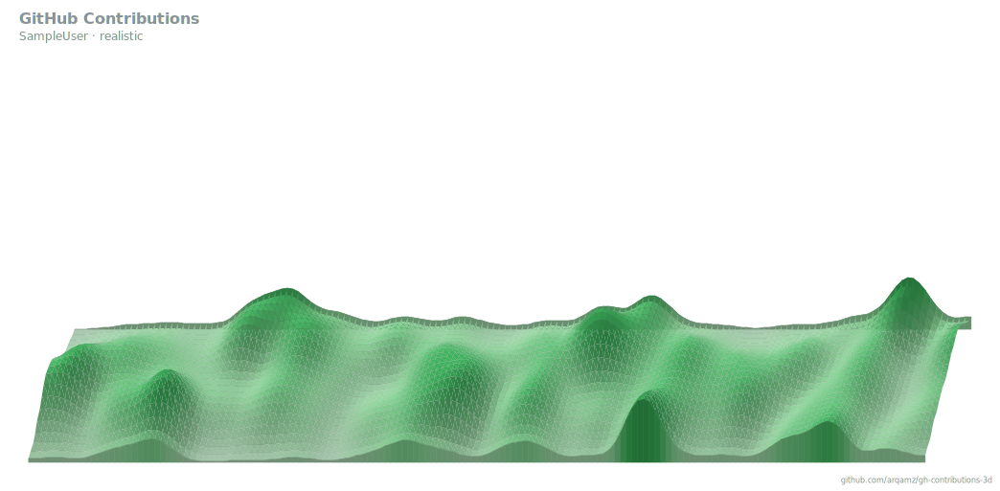

# 3D GitHub Contributions

Turn your GitHub contribution calendar into a 3D **terrain**. Busy days are nice green mountains while quiet days stretch as a pale flat plain. 
Keep it fresh on your profile README via GitHub Actions.

## Add it to your profile README

1. Add the workflow below to your **profile repo** (the one named exactly after
   your username) at `.github/workflows/profile-3d.yml`.

   ```yaml
   name: 3D contribution graph

   on:
     schedule:
       - cron: "0 0 * * *" # daily
     workflow_dispatch:
     push:
       branches: [main]

   permissions:
     contents: write

   jobs:
     render:
       runs-on: ubuntu-latest
       steps:
         - uses: actions/checkout@v4
         - name: Render 3D terrain
           uses: Arqamz/gh-contributions-3d@main
           with:
             github_user: ${{ github.repository_owner }}
             github_token: ${{ secrets.GITHUB_TOKEN }}
             output: profile-3d-contrib/terrain.svg
         - name: Commit updated SVG
           run: |
             git config user.name  "github-actions[bot]"
             git config user.email "github-actions[bot]@users.noreply.github.com"
             git add profile-3d-contrib/terrain.svg
             git diff --staged --quiet || git commit -m "chore: update 3D contribution graph"
             git push
   ```

2. Embed the generated SVG in your `README.md`:

   ```markdown
   
   ```

3. Push. The workflow runs daily (and on demand via **Actions → Run workflow**),
   regenerating and committing the SVG.

### Inputs

| Input          | Description                                                     | Default                       |
| -------------- | --------------------------------------------------------------- | ----------------------------- |
| `github_user`  | Username to render                                              | —                             |
| `github_token` | Token with read access to contributions                        | —                             |
| `output`       | Path in your repo to write the SVG                              | `profile-3d-contrib/terrain.svg` |
| `angle`        | `low` \| `medium` \| `high` \| `top`, or a raw `rowRise` number | `medium`                      |
| `smoothness`   | `0`–`1` (0 = sharp low-poly, 1 = smooth hills)                  | `1`                           |
| `mode`         | `terrain` \| `columns`                                          | `terrain`                     |

`secrets.GITHUB_TOKEN` covers public contributions; use a
[PAT](https://github.com/settings/tokens) for private ones. A copy of the
workflow lives in [`examples/profile-3d.yml`](./examples/profile-3d.yml).

## Local usage & development

Running the renderer locally, the CLI flags, and how the terrain is built are
documented in [`docs/DEVELOPMENT.md`](./docs/DEVELOPMENT.md).

## License

[MIT](./LICENSE)
