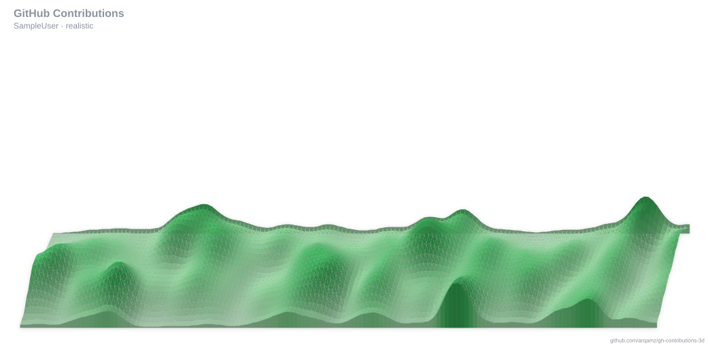
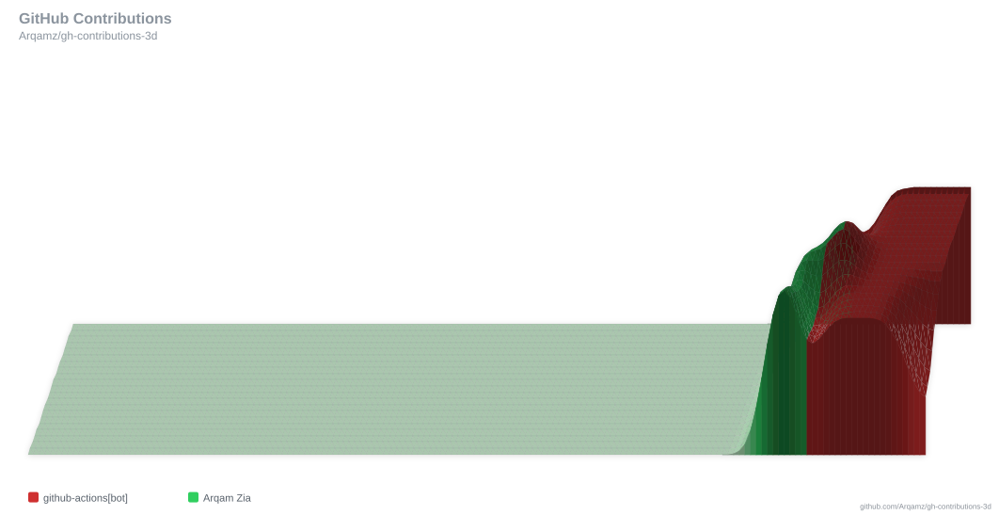

# 3D GitHub Contributions

Turn your GitHub contribution calendar into a 3D **terrain**. Busy days are nice green mountains while quiet days stretch as a pale flat plain. 
Keep it fresh on your profile README via GitHub Actions.

## Add it to your profile README

1. Add the workflow below to your **profile repo** (the one named exactly after
   your username) at `.github/workflows/profile-3d.yml`.

   ```yaml
   name: 3D contribution graph

   on:
     schedule:
       - cron: "0 0 * * *" # daily
     workflow_dispatch:
     push:
       branches: [main]

   permissions:
     contents: write

   jobs:
     render:
       runs-on: ubuntu-latest
       steps:
         - uses: actions/checkout@v4
         - name: Render 3D terrain
           uses: Arqamz/gh-contributions-3d@main
           with:
             github_user: ${{ github.repository_owner }}
             github_token: ${{ secrets.GITHUB_TOKEN }}
             output: profile-3d-contrib/terrain.svg
         - name: Commit updated SVG
           run: |
             git config user.name  "github-actions[bot]"
             git config user.email "github-actions[bot]@users.noreply.github.com"
             git add profile-3d-contrib/terrain.svg
             git diff --staged --quiet || git commit -m "chore: update 3D contribution graph"
             git push
   ```

2. Embed the generated SVG in your `README.md`:

   ```markdown
   
   ```

3. Push. The workflow runs daily (and on demand via **Actions → Run workflow**),
   regenerating and committing the SVG.

### Inputs

| Input          | Description                                                     | Default                       |
| -------------- | --------------------------------------------------------------- | ----------------------------- |
| `source`       | `user` (a profile's calendar) or `repo` (this repo's commits)   | `user`                        |
| `github_user`  | Username to render (required for `source: user`)                | —                             |
| `github_token` | Token with read access to contributions (`source: user` only)   | —                             |
| `output`       | Path in your repo to write the SVG                              | `profile-3d-contrib/terrain.svg` |
| `angle`        | `low` \| `medium` \| `high` \| `top`, or a raw `rowRise` number | `medium`                      |
| `smoothness`   | `0`–`1` (0 = sharp low-poly, 1 = smooth hills)                  | `1`                           |
| `mode`         | `terrain` \| `columns`                                          | `terrain`                     |

`secrets.GITHUB_TOKEN` covers public contributions; use a
[PAT](https://github.com/settings/tokens) for private ones. A copy of the
workflow lives in [`examples/profile-3d.yml`](./examples/profile-3d.yml).

## Track a single repo (contributor colours)

Point the action at a repository instead of a person and it renders **that
repo's** last year of commits as terrain, tinting each day by its **most active
committer**. A repo with many contributors turns into a rainbow of coloured
peaks (with a legend); a solo repo stays the usual GitHub green. Where a day has
several authors, the one with the most commits that day wins the colour.



> ☝️ That's **this repo rendering itself** — regenerated by the
> [`Self terrain`](./.github/workflows/repo-3d.yml) workflow (which references the
> action locally with `uses: ./`). It's a solo project, so it stays green; add
> more contributors and each gets their own colour.

Drop this into any repo at `.github/workflows/repo-3d.yml` (full file in
[`examples/repo-3d.yml`](./examples/repo-3d.yml)):

```yaml
name: 3D repo terrain

on:
  schedule:
    - cron: "0 0 * * *" # daily
  workflow_dispatch:
  push:
    branches: [main]

permissions:
  contents: write

jobs:
  render:
    runs-on: ubuntu-latest
    steps:
      - uses: actions/checkout@v4
        with:
          fetch-depth: 0 # required: repo mode needs full history, not a shallow clone
      - name: Render 3D repo terrain
        uses: Arqamz/gh-contributions-3d@main
        with:
          source: repo
          output: profile-3d-contrib/repo.svg
      - name: Commit updated SVG
        run: |
          git config user.name  "github-actions[bot]"
          git config user.email "github-actions[bot]@users.noreply.github.com"
          git add profile-3d-contrib/repo.svg
          git diff --staged --quiet || git commit -m "chore: update 3D repo terrain"
          git push
```

> **`fetch-depth: 0` matters.** `actions/checkout` does a shallow (single-commit)
> clone by default; repo mode reads the whole commit log, so without it the
> terrain would be nearly empty.

## Local usage & development

Running the renderer locally, the CLI flags, and how the terrain is built are
documented in [`docs/DEVELOPMENT.md`](./docs/DEVELOPMENT.md).

## License

[MIT](./LICENSE)
